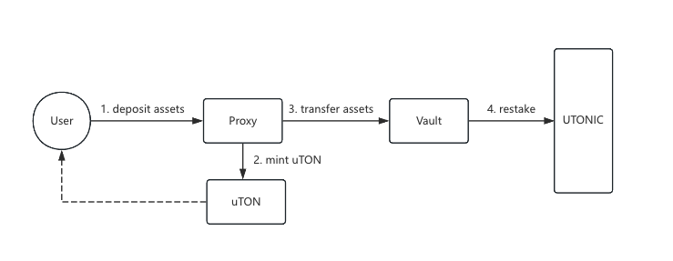

# uTON contracts


<div align="center">
    
</div>

Contracts for the uTON Jetton, the native embedded liquid restaking token (LRT) of TON in the UTONIC platform. 


## Overview

Users can mint LRT (uTON) with native TON and LST TON (e.g. stTON, tsTON). uTON is always fully backed by restaked TON and LST of TON. This repository contains contracts related to the lifecycle management of uTON.

<div align="center">
    
    <p style="font-size:12px">This is just a logic diagram, as the asynchronous architecture of TON has implementation differences. Please refer to the documentation for specifics.</p>
</div>


## Licensing

The primary license for uTON contracts is the Business Source License 1.1 (BUSL-1.1), see [LICENSE](https://github.com/UTONICFinance/utonic-contracts/blob/main/LICENSE). 


## Quickstart

Install dependencies

```
$ cd utonic-contracts
$ npm install
```

Compile the *minter*, *wallet* and *withdraw* contracts.

```
$ npm run compileminter
$ npm run compilewallet
$ npm run compilewithdraw
```
