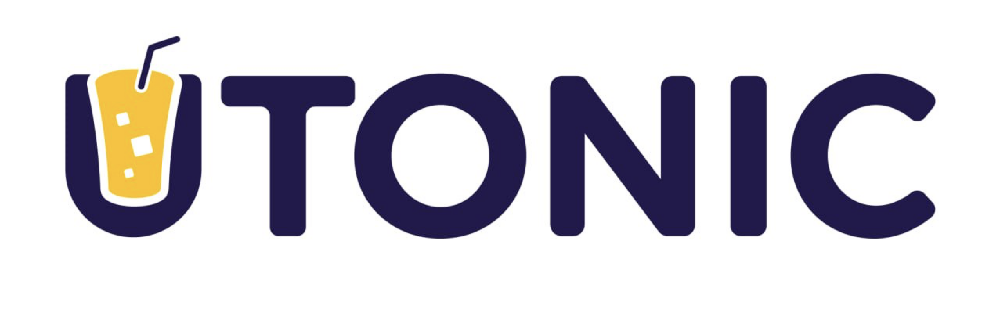

# uTON contracts


<div align="center">
    
</div>

Contracts for the uTON Jetton, the native embedded liquid restaking token (LRT) of TON in the UTONIC platform.


### Licensing

The primary license for uTON contracts is the Business Source License 1.1 (BUSL-1.1), see [LICENSE](https://github.com/UTONICFinance/utonic-contracts/blob/main/LICENSE). 


### Quickstart

Install dependencies

```
$ cd utonic-contracts
$ npm install
```

Compile the *minter*, *wallet* and *withdraw* contracts.

```
$ npm run compileminter
$ npm run compilewallet
$ npm run compilewithdraw
```
