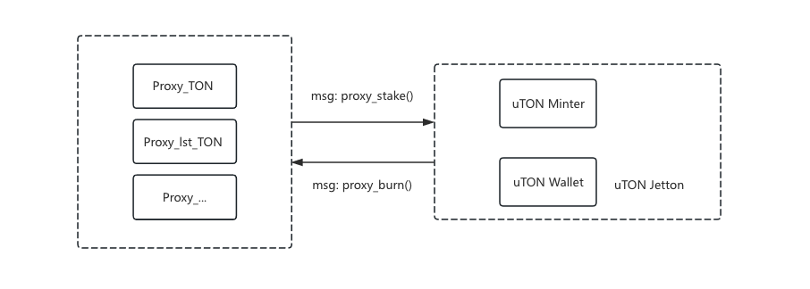
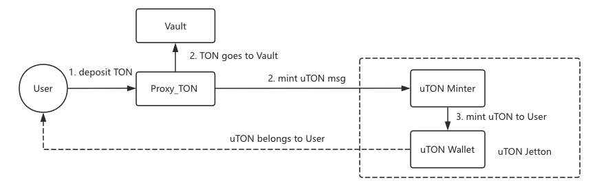
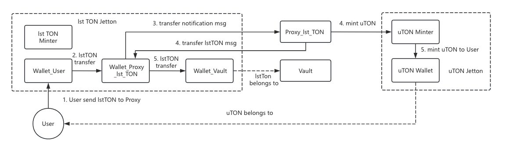
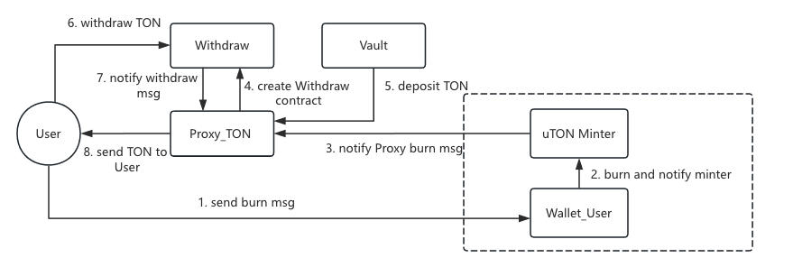

## Overall Architecture

    

The uTON contracts are divided into two parts: one part is the uTON Jetton, which has a standard Jetton interface and extends some capabilities based on demand; the other part consists of a series of Proxy contracts. The Proxy contracts have the authority to mint uTON, with different Proxy contracts implementing the uTON mint/burn process for various scenarios.

Key features:

1. When Proxy mints uTON, it is valued in TON, and the Proxy internally manages assets, such as LST TON, relative to the price of TON.
2. uTON Minter manages the uTON price of TON. It can be modified by the admin account.

### The uTON Jetton

Main related contracts: 

| Contract             | Role
| -------------        | --------
| minter.func          | The Jetton Minter contract, implementing the Jetton standard
| wallet.func          | The Jetton Wallet contract, implementing the Jetton standard

### Mint uTON with native TON

    

### Mint uTON with lst TON (Jetton)

    

### Withdraw with uTON

    

